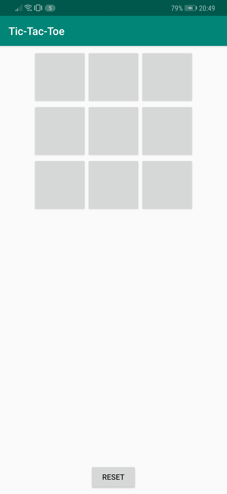
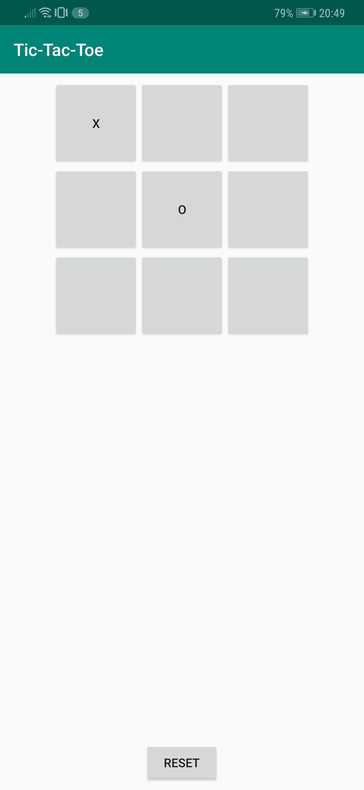
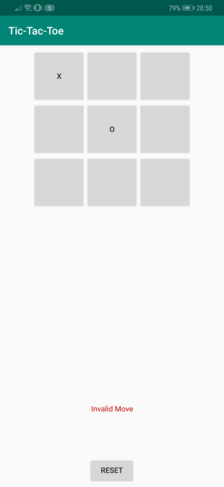
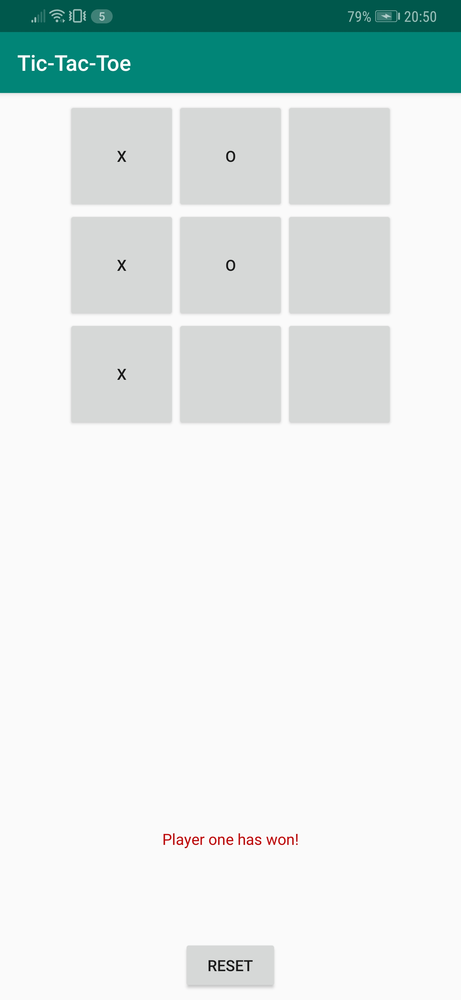
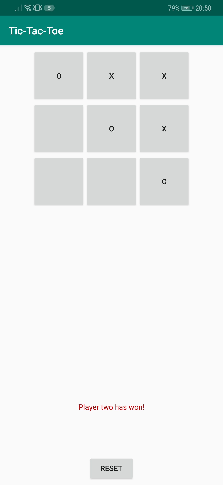
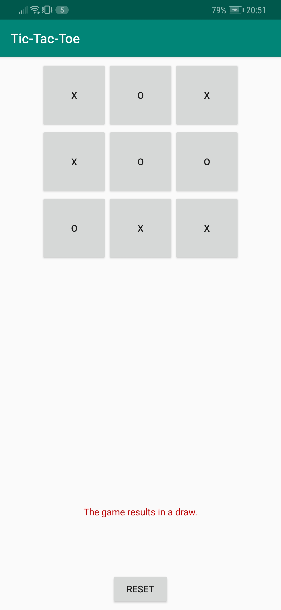
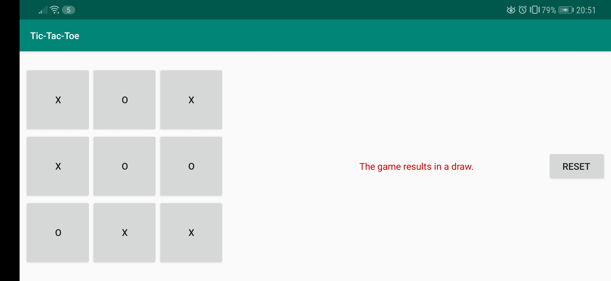

# Tic-Tac-Toe
A short description of the app Tic-Tac-Toe.

## Getting Started
### Prerequisites
The app is created in Android-Studio, it is currently made for API 24 Nougat (Android 7.0), but also confirmed running on API 28 Pie (Android 9.0).
An android phone with either one of those Android versions (and most likely the versions in between) will suffice.

### Testing
When launching the app, a screen appears showing an empty board of tiles and a reset button.

Now two players take turn in filling up the board by clicking the tiles. Player one will always fill a tile with a 'x' and player two will fill a tile with a 'o'.

If a tile is picked again, the board will not change and a prompt will be given in the form of a message.

If one of the players manages to get three tiles in a row, the game will be over and a message will appear specifying which player has won. After this, no tiles can be clicked again.

 

The game results in a draw if all tiles have been filled and none of the players have won.

The game can also be played in landscape mode. The set board will be saved when switching from horizontal to landscape mode.

## Author
* Me

## Acknowledgements
* Renske Talsma
* Natasja Wezel
